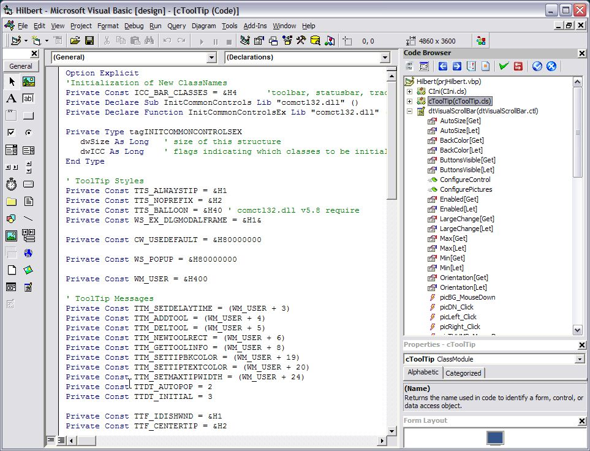



## CodeBrowser

### Description

Replacement for the IDE Project Explorer.
 
### More Info
 
I got bored by the eternal browsing in the IDE labyrinth; why not try to build an extended project explorer?

Microsoft left the IDE object unfinished and I was wondering if something like this would be still possible. After checking all examples available on the net, I started with experiments. In same cases I found some little undocumented features, otherwise dirty but working tricks. The code is not elegant and furthermore I found the use of repetitions necessary to assure the necessary stability. The error routines are still the program foundation. At this point I used the CodeBrowser for a while and it seams to work well. Two Italian colleagues helped as testers.

Please don&#8217;t forget that this addin is incompatible with any other mouse hook.

I didn&#8217;t add a context menu while all items are already available in the IDE menu.

I used the MS Windowless controls to save resources, they are downloadable by Microsoft: I added them to this package for your convenience.

Have fun

Capodastro

incompatible with other mouse hooks.

             |
---                |---
**Submitted On**   |2005-06-28 01:14:02
**By**             |[Capodastro](https://github.com/Planet-Source-Code/PSCIndex/blob/master/ByAuthor/capodastro.md)
**Level**          |Intermediate
**User Rating**    |5.0 (15 globes from 3 users)
**Compatibility**  |VB 6\.0
**Category**       |[Libraries](https://github.com/Planet-Source-Code/PSCIndex/blob/master/ByCategory/libraries__1-49.md)
**World**          |[Visual Basic](https://github.com/Planet-Source-Code/PSCIndex/blob/master/ByWorld/visual-basic.md)
**Archive File**   |[CodeBrowse1967031222006\.zip](https://github.com/Planet-Source-Code/capodastro-codebrowser__1-64104/archive/master.zip)

